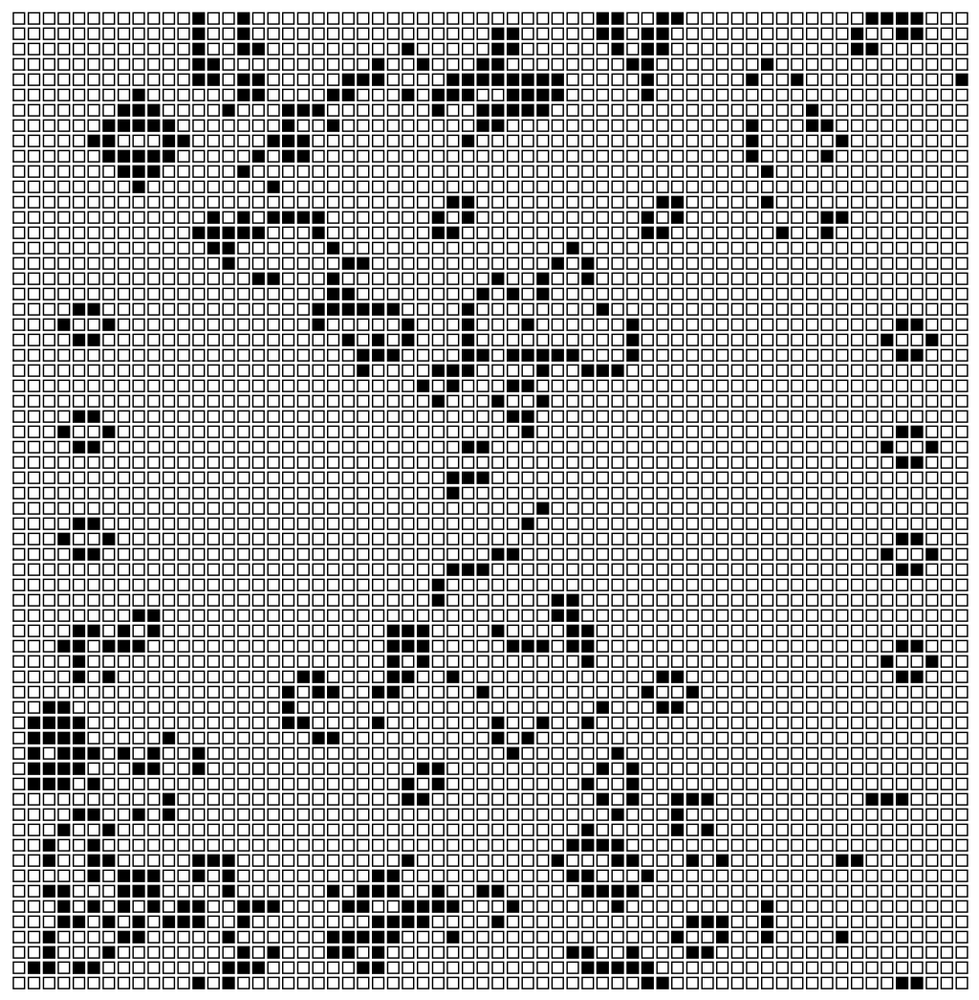
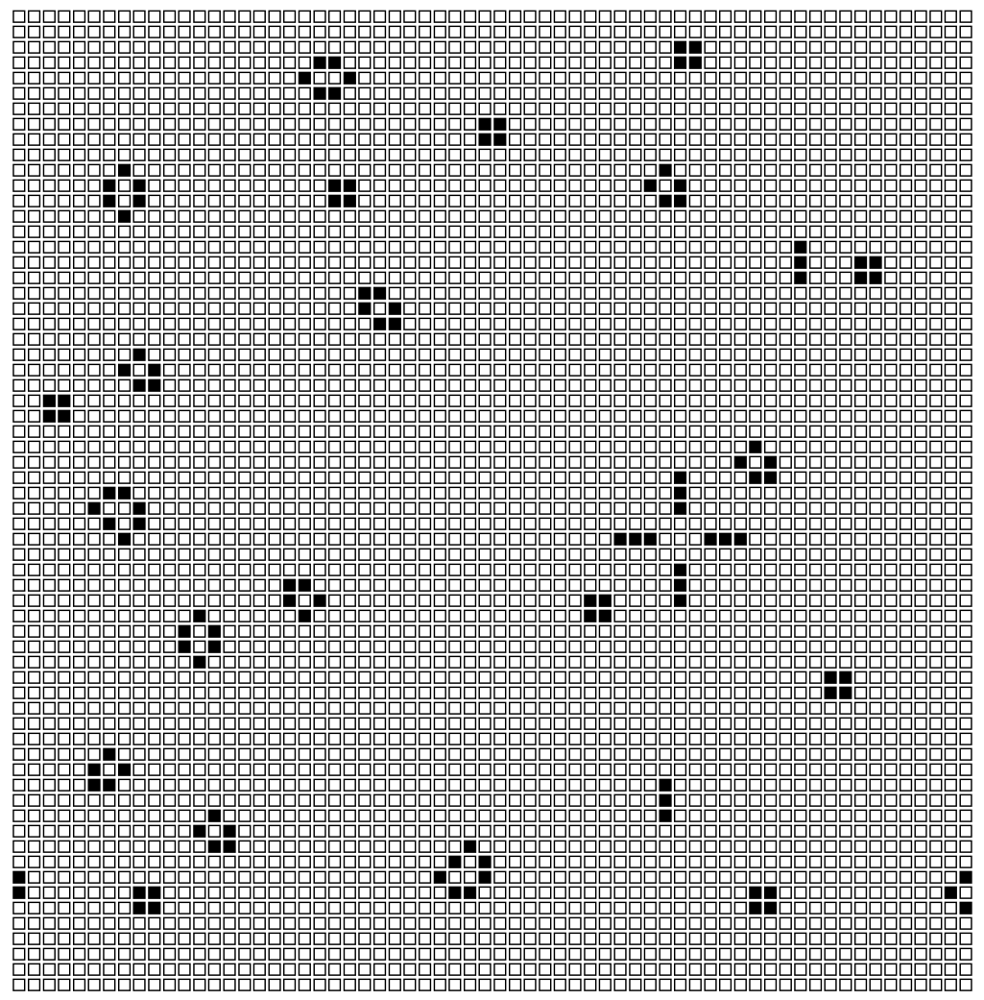

# learn-wasm

```bash
# Initialize the project
# https://github.com/lencx/create-xc-app
npm init xc-app learn-wasm -t wasm-react
```

## [Awesome Lists](./awesome-lists.md)

* [前端入门 ｜ Rust 和 WebAssembly](https://lencx.github.io/book/wasm/rust_wasm_frontend.html)
* [Awesome WebAssembly](https://mtc.nofwl.com/awesome/wasm.html)

## Examples

### @rsw/chasm

 \
 

### @rsw/game-of-life

 

### ffmpeg
